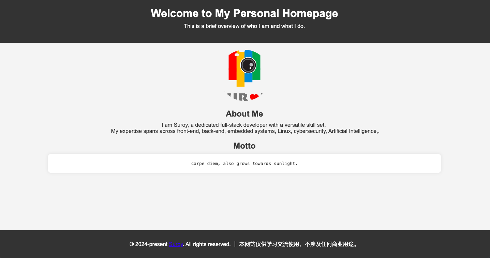

<!--suppress HtmlDeprecatedAttribute -->

<div align="center">
  <p>
      
  </p>

  <h1>Docker-Homepage</h1>
  <p> 基于Docker的个人主页样例</p>
  <p>开发环境: Vscode (MacOS)  </p>
  <p>作者: 👨🏻‍💻 Suroy (https://suroy.cn) </p>

  <p>
    <a href="https://suroy.cn"></a>
    <a href="https://github.com/zsuroy"></a>
    <a href="https://github.com/zsuroy"></a>
    <a href="https://github.com/zsuroy"></a>
    
  </p>
</div>

# 基于Docker构建的简单个人主页

技术栈: Docker + Alpine + Nginx + HTML + CSS + Javascript
> 该项目适用于初学者快速上手 Docker

本项目旨在展示如何使用 Docker 构建一个简单且美观的个人主页网站。该网站通过 Docker 容器化技术实现，可以动态地显示内容，并且支持在运行容器时传入参数来改变网页的显示内容。网站包括个人头像、简介和以座右铭形式展示的动态内容。



## 使用说明

```shell

# 拉取镜像
docker pull zsuroy/docker-for-learner:latest

# 运行
docker run -e CONTENT="Hello, Welcome to my personal homepage! <br> <br> Every cloud has a silver lining." -e ABOUT="I am Suroy." -p 8080:80 docker-for-learner

# 访问
http://127.0.0.1:8080
```
